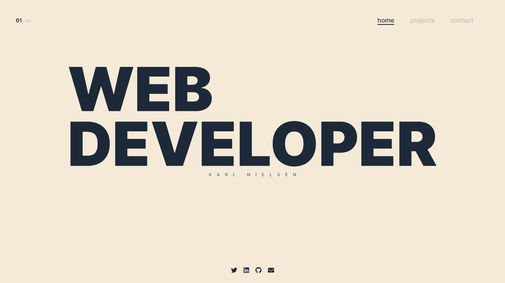

<h1 align="left">Hi , I'm Karl</h1>
<h3 align="left">Software engineer from Denmark</h3>

  
  
  
  
  

  
🧠 I’m currently learning <strong>Full stack web development</strong>

  
💻 All of my projects are available at <a href="https://www.mdia.dk/" target="_blank">https://www.mdia.dk/</a>

  
📫 Reach me at <strong>mail@mdia.dk</strong>, LinkedIn or Twitter

<!-- <h3 align="left">Connect with me:</h3>

 -->

<!-- <h3 align="left">Languages and Tools:</h3>

             
 -->

<h1 align="center">Projects</h1>
<table bordercolor="#66b2b2">
  
  <tr>
    <td width="50%" valign="top">
      <h3 align="center">mdia.dk (Portfolio)</h3>
         
        
         
        

          
    
  
      

        
<strong>HTML5, CSS3, JavaScript</strong> - My portfolio site containing my projects and contact info.

    </td>
    <td width="50%" valign="top">
      <h3 align="center">RUN AWAY</h3>
         
      
         
        

          
  
  
      

        
<strong>HTML5, CSS3, JavaScript</strong> - Website for album release of My Beautiful Dark Twisted Fantasy By Kanye West 

    </td>
  </tr>
  
  <tr>
    <td width="50%" valign="top">
      <h3 align="center">Salon Hair Valby</h3>
       
        
       
        

  
  
      

        
<strong>HTML5, CSS3, SASS, JavaScript - </strong>Project for a hair dresser, containing general info about the business

    </td>
  </tr>
</table>
          
          
          
<h1 align="center">Connect</h1>

  
  
  
  
  

